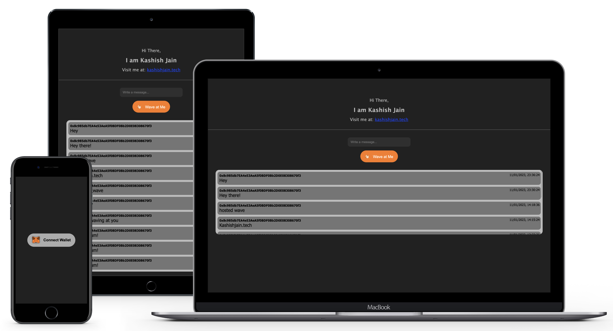

# Wave Portal

A place where anyone on the internet can learn a little about who you are and send you a 👋 + a message and have that data saved on the blockchain through an Ethereum smart contract.
#
### Technologies
&nbsp;&nbsp;&nbsp;&nbsp;Web3, Smart Contracts, Solidity, Metamask, Ethereum, Reactjs
#
